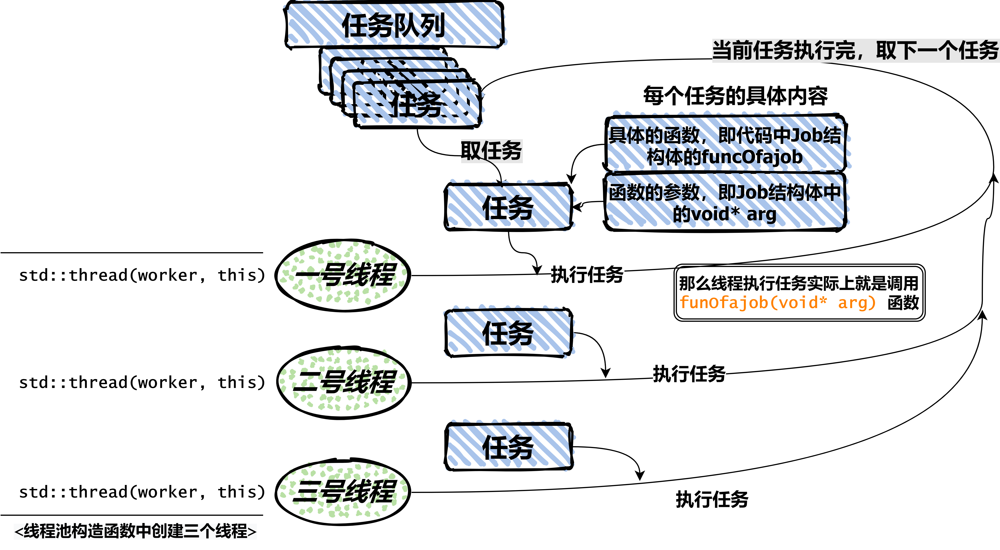
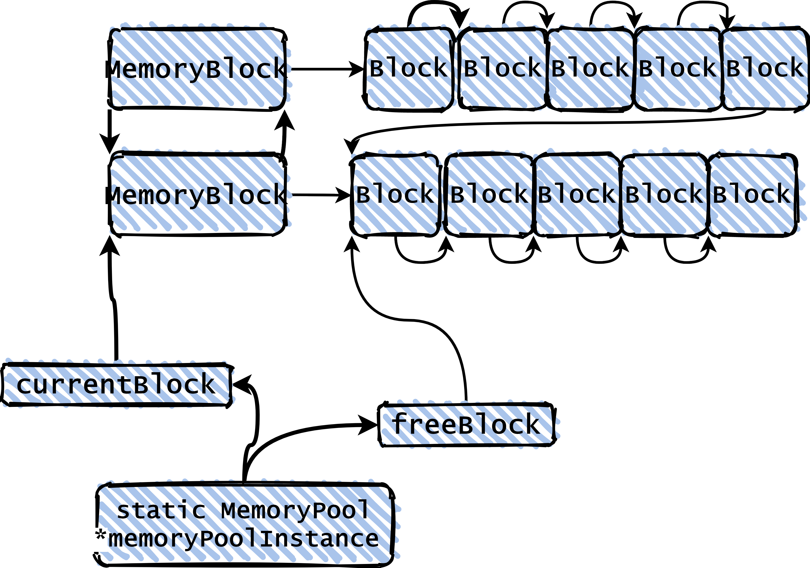

# TinyWebSerLinux

### Linux下的高性能web服务器

### 开发环境 ：

* Ubuntu20.04
* Clion
* g++ 3.10
* cmake
* 压测：Wenbench

### 编译及运行

```shell
cd cmake-build-debug
cmake .
make
./webserver -p [端口号] -t [线程数量] -d [守护进程模式] -r [pages所在路径]
//请注意运行时的位置，可以以如下方式运行
//首先，cd到与src,pages文件夹同一级
cd .. 
//并运行
./cmake-build-debug/webserver
//如此可以直接使用默认路径，无需重新指定pages路径，
```

* **单进程＋Reactor+非阻塞方式运行**
  
* **状态机解析HTTP请求，目前支持 HTTP GET、HEAD方法**
* **添加定时器支持HTTP长连接，定时回调handler处理超时连接**
* **使用 priority queue 实现的最小堆结构管理定时器，使用标记删除，以支持惰性删除，提高性能**
* **使用epoll + 非阻塞IO + 边缘触发(ET) 实现高并发处理请求，使用Reactor编程模型**
* **epoll使用EPOLLONESHOT保证一个socket连接在任意时刻都只被一个线程处理**
* **使用线程池提高并发度，并降低频繁创建线程的开销**
* **同步互斥的介绍**
* **使用RAII手法封装互斥器(`pthrea_mutex_t`)、 条件变量(`pthread_cond_t`)等线程同步互斥机制，使用RAII管理文件描述符等资源**
* **使用`shared_ptr`、`weak_ptr`管理指针，防止内存泄漏**

# 线程池实现

* 与网上常见线程池大同小异，不做赘述。
* 下一步计划使用C++11的thread库重新构建，简洁化代码



# 内存池实现



对于`HttpData`类，使用内存池管理，具体工作有两部分：

1. 创建手动管理的内存池，主要代码在`MemoryPool.cpp`以及`MemoryBlock.cpp`
   1. 整体设计为一个***Pool***下挂载多个`MemoryBlock`链（定义在`MemoryBlock.h`中的`struct MemoryBlock`），每个`MemoryBlock`链上是连续的多个可用内存块（定义在`MemoryBlock.h`中的`struct Block`）。由于是专门为`HttpData`类所设计，所以大小在`MemoroPool`初始化时设定，不可更改。
   2. 当一个`MemoryBloc`k链上内存块消耗殆尽，将会分配新的一条`MemoryBlock`链，与之前存在的`MemoryBlock`链并行的挂在Pool上（不是将两条链拼接）。事实上各个`MemoryBlock`链的头部构成一个环形的双向链表结构
   3. ***Pool***始重维护一个指向当前可用的Block块的指针
   4. `MemoryPool.cpp`：一个单例的`MemoryPool`，封装内存块的分配（`MemoryPool::Alloc()`）和回收(`MemoryPool::Deallocate(T* p)`)
2. 重载`HttpData`类的`new`和`delete`
   1. 重载`new`：直接从内存池中取一块`Block`,在HttpData类中重载`operator new`即可
   2. 重载`delete`：首先，`HttpData`类的创建使用`shared_ptr`，因此重载`delete`的实际实现是重写`shared_ptr`的析构函数
3. 线程安全：
   1. 整个程序运行时有多个线程和单个`Pool`，要保证内存池中内存的分配和回收是线程安全的，但是毫无疑问会降低效率
   2. 之后考虑对每个线程都分配指定的内存池
